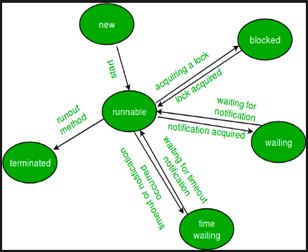

# Java Multi-Threading
**Thread**: Lightweight sub process, with separate and independent path of execution, created by `java.lang.Thread` class.
Note: Instructions in a single thread always run synchronously.
## States of a Thread


- **NEW**: Thread created but not yet started.
- **RUNNABLE**: Thread ready to run is moved in runnable state. Here, a thread is either running or is ready to run in JVM, though it may be waiting for other resources from the operating system such as processor.
- **BLOCKED**: Thread temporarily inactive as it tries to access a protected section of code that is currently locked by some other thread.
- **WAITING**: Thread temporarily inactive as its waiting for another thread to perform a particular action. Caused by calling:
    - Object.wait with no timeout
    - Thread.join with no timeout
    - LockSupport.park
- **TIMED_WAITING**: Thread waiting for a specified time. Caused by:
    - Thread.sleep
    - Object.wait with timeout
    - Thread.join with timeout
    - LockSupport.parkNanos
    - LockSupport.parkUntil
- **TERMINATED**: A thread that has exited is in this state.

## Creating Thread
All thread are created cascading from the `main` thread. Threads are created as:
- If the main thread has some long running task, then as a thread is synchronous, this task will make the application appear non-responding. So, long-running independent tasks (like downloading files) must be run on separate threads.
- Multithreading allows concurrency and can increase performance by using multiple CPU cores.

**Ways** to create thread:
1. Using **Thread Class**:
    - **How to use?**
        - *Create class* `MyThread`, and *extend* class `Thread`.
        - *Override* method `run()`.
        - *Create object* of `MyThread` class and *invoke method `start()`* which starts running code present in method `run()` in a new thread.
    - **Difference** between `start()` and `run()`:
        - `start()` creates a new thread and runs the code in `run()` in that, but if you call `run()` directly, the code in it will be executed in the same thread.
        - You can call `start()` on an thread instance once only (as it changes the state of thread), though `run()` can be called any number of times.
    - **NOTE:** Understand that CPU can switch between threads at any instance. Run **[this code](https://gist.github.com/codekaust/7b8d86c3f7ad9612040d0a75ebe83ea7)** multiple times and observe.
2. Using **Runnable Interface**: (as multiple inheritance is not allowed in java) (preferred)
    - Any how, you *need to use `Thread` class only* to create and execute a new thread. **`Thread` class has constructor which takes `Runnable` object as input**. Constructors in `Thread` can have either, none or all of following parameters:
        - runnable_object
        - thread_name
    - **Reducing LoC:**
        - Use anonymous class while passing object of `Runnable` in `Thread` constructor.
        - Use lambdas, as **Runnable is a functional interface**.
    - **How to use?**
        - Create class `MyRunnable`, implement interface `Runnable`.
            - override method `run()`
        - Create object of `Thread` by passing instance of `MyRunnable`.
            - `Thread thread = new Thread(myRunnable);`
        - Execute thread by `thread.start()`

## Examples for Syntax
#### ThreadUsingThreadClass
```java
public class ThreadUsingThreadClass{
	public static void main(String[] args) {
		System.out.println("Main thread name: "+ Thread.currentThread().getName());

		Thread t = new Thread(/*Thread name*/"Thread 1");
		t.start();

		// "Thread" constructor with thread_name parameter not "MyThread"
		// MyThread mt = new MyThread("Example_Thread");
		// mt.start();

		MyThread mt = new MyThread();
		mt.start();

		MyThread2 mt2 = new MyThread2("Example_Thread2");
		mt2.start();
	}
}

class MyThread extends Thread{
	public void run(){
		System.out.println("Thread name: "+ Thread.currentThread().getName());
		System.out.println("Thread id: "+ Thread.currentThread().getId());
	}
}

class MyThread2 extends Thread{
	public MyThread2(String thread_name){
		super(thread_name);
	}

	public void run(){
		System.out.println("Thread name: "+ Thread.currentThread().getName());
		System.out.println("Thread id: "+ Thread.currentThread().getId());
	}
}
```
Take note of **line 9, 30**.
#### ThreadUsingRunnableInterface
Without using lambda:
```java
public class ThreadUsingRunnableInterface{
	public static void main(String[] args) {
		//without name
		Thread t1 = new Thread(new MyRunnable());
		t1.start();

		//with name
		Thread t2 = new Thread(new MyRunnable(), "Example_thread");
		t2.start();
	}
}

class MyRunnable implements Runnable{
	public void run(){
		System.out.println("Thread name: "+ Thread.currentThread().getName());
		System.out.println("Thread id: "+ Thread.currentThread().getId());
	}
}
```


Using lambda and Anonymous class:
```java
public class ThreadUsingRunnableInterface{
	public static void main(String[] args) {
		Thread t2 = new Thread(
			()-> {
				System.out.println("Thread name: "+ Thread.currentThread().getName());
				System.out.println("Thread id: "+ Thread.currentThread().getId());
			}, "Example_thread");
		t2.start();
	}
}
```
## More about Threads
### <u>Daemon Threads</u>
Daemon thread is a lowest priority thread that runs in background to perform tasks such as garbage collection. Daemon threads *cannot prevent JVM to exit* once all users have completed execution (which means once all user threads are executed, JVM exits, closing all daemons threads also, even if they are running)
**Syntax**:
```java
public class DaemonExample{
	public static void main(String[] args) {
		Thread t = new Thread(
			()-> {
				System.out.println("Thread name: "+ Thread.currentThread().getName());
				System.out.println("Thread id: "+ Thread.currentThread().getId());
			}, "Example_thread");

		//sets t2 as daemon thread
		t.setDaemon(true);

		t.start();
	}
}
```
Because of line 10, nothing will print (as main exits as soon as t starts). [Check this out](./2.png).
### <u>Important Methods</u>
#### Thread.currentThread()
This static method return object of currently executing thread.
#### NAME and ID:
Note: You can never set id for any thread.
1. Using constructor:
    - In constructor of class `Thread`, one may pass thread name as parameter.
    - If you use `MyThread extends Thread` use `super`. See [ThreadUsingThreadClass] example.
2. Using getters and setters:
    - Can use `thread.getName()`, `thread.getId()` to get the respective.
        - Can use `this` as `thread` object inside a `Thread` class.
        - You may get the `thread` object using `Thread.currentThread()`. Helpful to get `thread` object in static functions.
#### Thread.sleep(millisecs):
- This method is used to make the current thread sleep for some milliseconds.
#### thread.isAlive() *&* thread.join()
Usage:
```java
public class MyClass{
	public static void main(String[] args) {
		MyThread m = new MyThread();
		System.out.println(m.isAlive());
		m.start();
		System.out.println(m.isAlive());

		try{
			m.join();
		} catch(Exception e){}

		System.out.println(m.isAlive());
	}
}

class MyThread extends Thread{
	public void run(){
		System.out.println(Thread.currentThread().isAlive());
	}
}
```
Output:
```
false
true
true
false
```
Output if you comment `m.join()`:
```
false
true
true
true
```
### <u>Thread Priorities</u>
In JVM every thread must have a priority either given by degfault by JVM or by programmer. Thread priorities in java vary from **1 to 10** (priority increases with number).
- 1 = least priority
- 5 = normal priority
- 10 = highest priority

*Default Priority*: **Child thread has same priority as parent thread by default**. Main thread has priotity 5 by default.

*Meaning of priority*: Thread with highest priority will get execution chance prior to other threads. If two have same priority then we can’t expect which thread will execute first (depends on scheduler's algo).

*Inbuilt constants*: `Thread.MIN_PRRIORITY`,  `Thread.MAX_PRIORITY`, `Thread.NORM_PRIORITY`.

*Methods*: `thread.setPriority(int p)`**,** `thread.getPriority()`.

## Synchronized Keword
In multithreading, multiple threads may try to access the same resources and finally produce erroneous results. 

Synchronized Blocks (marked by keyword **synchronized**): Help in synchronization of tasks of different threads. A synchronized block in Java is synchronized on some object. All synchronized blocks synchronized on the same object can only have one thread executing inside them at a time.

In Java, synchronization is implemented using concept called monitors. Only one thread can own a monitor at a given time.

Try to run the following code multiple times, you will find different results every time (as line 5 is not a single instruction and thread may change in between).
```java
class Counter{
	int ct = 0;

	public void increment(){
		ct++; //ct = ct+1
	}
}

public class MyClass {
	public static void main(String[] args) throws Exception{
		Counter c = new Counter();

		Thread t1 = new Thread(()-> {
			for(int i=0; i<1000; i++){
				c.increment();
			}
		});

		Thread t2 = new Thread(()-> {
			for(int i=0; i<1000; i++){
				c.increment();
			}
		});

		t1.start();
		t2.start();

		//complete execution of both threads and print c.ct
		t1.join();
		t2.join();
		System.out.println(c.ct);
	}
}
```

Solution: Add keyword **`synchronized`** to method `increament()`.
```java
class Counter{
	int ct = 0;

	public synchronized void increment(){
		ct++; //ct = ct+1
	}
}
```
## Inter-Thread Communication
Communication between two threads is done basically using methods: `wait()`, `notify()`, `notifyAll()` methods.

Inter-thread communication is required when there is dependence between two threads to perform a task which arises basically due to a order in which parts of task are to be done. This can be done using *Polling* (checking condition repeatedly).

A better approach can be to:
- Make the methods of the object which will make a thread `wait` or `notify` as synchronized.
- If a thread *A* is dependent on some update from *B*, then:
    -  Make them work on the same object
    -  Make thread *A* `wait()`.
    -  Make change from thread *B* and `notify()`

**NOTE:** Methods `wait()`, `notify()`, `notifyAll()` are present in class `Object` and not in class `Thread`.

### Thread Lifecycle


### Difference b/w `notify()` and `notifyAll()`
1. `notify()` method send notification to only one of waiting thread while `notifyAll()` informs all threads waiting on that lock.
2. Using `notify()`, it's not guaranteed that, which thread will be informed.
3. `notifyAll()` can drain more CPU cycles than `notify()` itself but if you really want to sure that your notification doesn't get wasted by any reason, use `notifyAll()`.
### Example: Producer - Consumer Problem
Desired: We want that as in a loop a sequence of putting a new value and getting it occurs.

Consider the program:
```java
class Item{
	//represent number of item
	int num;

	public Item(int num){
		this.num = num;
	}

	public void put(int num){
		System.out.println("Put: "+num);

		this.num = num;
	}

	public void get(){
		System.out.println("Get: "+this.num);
	}
}

//this will update the num
class Producer implements Runnable{
	Item item;

	public Producer(Item item){
		this.item = item;

		Thread t = new Thread(this, "Producer");
		t.start();
	}

	public void run(){
		int i=0;

		//infinitely keep increasing the value every 1 sec (just example for demonstration)
		while(true){

			item.put(i++);

			try{Thread.sleep(1000);}catch(Exception e){}
		}
	}
}

//this will use num (print it for eg.)
class Consumer implements Runnable{
	Item item;

	public Consumer(Item item){
		this.item = item;

		Thread t = new Thread(this, "Producer");
		t.start();
	}

	public void run(){
		//infinitely keep increasing the value every 1 sec (just example for demonstration)
		while(true){

			item.get();
		
			try{Thread.sleep(1000);}catch(Exception e){}
		}
	}
}

public class test{
	public static void main(String[] args) throws Exception{
		Item item = new Item(0);
		new Producer(item);
		new Consumer(item);
	}
}
```
You will notice patters like:
```
Put: 1
Put: 2
Get: 1
```
So we are getting wrong value and the methods are not in order. Wrong value issue can be used by using **synchronized** keyword for `put()` and `get()`. But, then the correct order may still not appear (try making the waiting times for while loops different to make the order problematic).

Correct way:
```java
class Item{
	//represent number of item
	int num;

	boolean valueSet = false;

	public Item(int num){
		this.num = num;
	}

	public synchronized void put(int num){
		while(valueSet){
			try{ 
				wait();
			} catch (Exception e) {}
		}

		System.out.println("Put: "+num);

		this.num = num;
		valueSet = true;
	}

	public synchronized void get(){
		while(!valueSet){
			try{ 
				wait();
			} catch (Exception e) {}
		}

		System.out.println("Get: "+this.num);
		valueSet = false;

		notify();
	}
}

//this will update the num
class Producer implements Runnable{
	Item item;

	public Producer(Item item){
		this.item = item;

		Thread t = new Thread(this, "Producer");
		t.start();
	}

	public void run(){
		int i=0;

		//infinitely keep increasing the value every 1 sec (just example for demonstration)
		while(true){

			item.put(i++);

			try{Thread.sleep(1000);}catch(Exception e){}
		}
	}
}

//this will use num (print it for eg.)
class Consumer implements Runnable{
	Item item;

	public Consumer(Item item){
		this.item = item;

		Thread t = new Thread(this, "Producer");
		t.start();
	}

	public void run(){
		//infinitely keep increasing the value every 1 sec (just example for demonstration)
		while(true){

			item.get();
		
			try{Thread.sleep(1000);}catch(Exception e){}
		}
	}
}

public class test{
	public static void main(String[] args) throws Exception{
		Item item = new Item(0);
		new Producer(item);
		new Consumer(item);
	}
}
```

Here we have update the `put()` and `get()` methods.

**Notice**:
1. Multiple threads that are communicating using `wait()` and `notify()` must run on same instance of class (object).
2. The `wait()`, `notify()`, `notify()` are all part of class `Object` so must be present in the functions of the shared object.
    - Note: Such functions must be synchronized.
3. In the above code you can even change the sleep time for producer and consumer by any amount (bringing any difference), still it won't cause any problem.
4. Try to notice difference between `sleep` and `wait`.
    - `sleep` is time based, but `wait` makes thread wait for notification.
    - `sleep` is part of `Thread` class but `wait` is part of `Object` class.