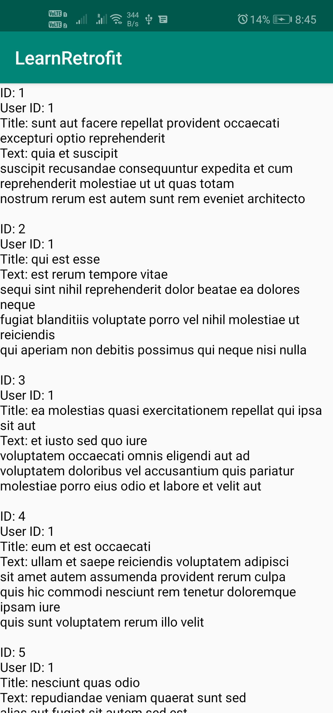

This are short notes for Retrofit from [here](https://www.youtube.com/watch?v=4JGvDUlfk7Y).

**Retrofit**: A type-safe HTTP client for Android and Java.
# GET
### Dependecies and Permissions
Add the following in your app level dependencies:
```gradle
implementation 'com.squareup.retrofit2:retrofit:2.4.0'
implementation 'com.squareup.retrofit2:converter-gson:2.4.0'
```

Add the following line for internet permission in android manifest file outside `application` tag:
```    
<uses-permission android:name="android.permission.INTERNET" />
```

### Model Class
The JSON data we are using is available here: https://jsonplaceholder.typicode.com/posts . (like REST API)
Example:
```json
[
  {
    "userId": 1,
    "id": 1,
    "title": "sunt aut facere repellat provident occaecati excepturi optio reprehenderit",
    "body": "quia et suscipit\nsuscipit recusandae consequuntur expedita et cum\nreprehenderit molestiae ut ut quas totam\nnostrum rerum est autem sunt rem eveniet architecto"
  },
  {
    "userId": 1,
    "id": 2,
    "title": "qui est esse",
    "body": "est rerum tempore vitae\nsequi sint nihil reprehenderit dolor beatae ea dolores neque\nfugiat blanditiis voluptate porro vel nihil molestiae ut reiciendis\nqui aperiam non debitis possimus qui neque nisi nulla"
  }
]
```

Create a model class `Post`:
```kotlin
import com.google.gson.annotations.SerializedName

data class Post (var userId : Int,
                 var id : Int,
                 var title: String,
                 @SerializedName("body") var text : String)
```

Notice `@SerializedName("body")` represents that entry with key `body` in JSON is to be mapped to variable `text`.

### View
Just put a `TextView` with `match_parent` dimensions inside a `androidx.core.widget.NestedScrollView`.

NOTE: TextView **id is `text_view`**.

### Interface
Create an interface to represent the API of the web-servers in our app. Create a file `JSONPlaceHolderAPI.kt`, paste the code for interface:
```kotlin
import retrofit2.Call
import retrofit2.http.GET

interface JSONPlaceHolderAPI{

    @GET("posts")
    fun getPosts() : Call<List<Post>>
}
```

Notice `@GET("posts")`. This defines that this methods *gets* the list of *posts* which is stored at `baseurl/posts`. In our case base-url is https://jsonplaceholder.typicode.com/. The base-url is referred later.

### MainActivity
Code:
```kotlin
import androidx.appcompat.app.AppCompatActivity
import android.os.Bundle
import kotlinx.android.synthetic.main.activity_main.*
import retrofit2.Call
import retrofit2.Callback
import retrofit2.Response
import retrofit2.Retrofit
import retrofit2.converter.gson.GsonConverterFactory

class MainActivity : AppCompatActivity() {

    override fun onCreate(savedInstanceState: Bundle?) {
        super.onCreate(savedInstanceState)
        setContentView(R.layout.activity_main)

        val retrofit: Retrofit = Retrofit.Builder()
            .baseUrl("https://jsonplaceholder.typicode.com/")
            .addConverterFactory(GsonConverterFactory.create())
            .build()

        val jsonPlaceHolderAPI = retrofit.create(JSONPlaceHolderAPI::class.java)

        val call: Call<List<Post>> = jsonPlaceHolderAPI.getPosts()

//        call.execute()

        call.enqueue(object : Callback<List<Post>> {
            override fun onFailure(call: Call<List<Post>>, t: Throwable) {
                text_view.text = t.message
            }

            override fun onResponse(call: Call<List<Post>>, response: Response<List<Post>>) {
                if(response.isSuccessful){
                    val posts : List<Post>? = response.body()

                    if (posts != null) {
                        for(post in posts){
                            var content = ""
                            content += "ID: " + post.id + "\n"
                            content += "User ID: " + post.userId + "\n"
                            content += "Title: " + post.title + "\n"
                            content += "Text: " + post.text + "\n\n"

                            text_view.append(content)
                        }
                    }
                }else{
                    text_view.text = response.code().toString()
                }
            }

        })
    }
}
```

Notice the commented line : `call.execute()`. It executes the call in current thread only which cannot be done.

### Result


### Further
For URL MANIPULATION: @PATH @QUERY @QUERYMAP @URL watch [Retrofit Tutorial Part 2 Coding in FLow](https://www.youtube.com/watch?v=TyJEDhauUeQ). See the following methods:
```kotlin
@GET("posts")
fun getPosts(
    @Query("userId") userId: Array<Int>,
    @Query("_sort") sort: String,
    @Query("_order") order: String
): Call<List<Post>>

@GET("posts")
fun getPosts(@QueryMap parameters: Map<String, String>): Call<List<Post>>

@GET("posts/{id}/comments")
fun getComments(@Path("id") postId: Int): Call<List<Comment>>

@GET
fun getComments(@Url url: String): Call<List<Comment>>
```

# POST
### Interface
Add the following method in the `JSONPlaceHolderAPI` interface to post.
```kotlin
@POST("posts")
fun createPost(@Body post: Post) : Call<Post>
```
Note that this will convert post object to JSON and send to REST API.

### MainActivity
Add the following code in MainActivity:
```kotlin
/**********POST***********/
//we wont put in id as this is added by REST api for every post
val post: Post = Post(5, null, "TitleString", "BodyString")

val call2: Call<Post> = jsonPlaceHolderAPI.createPost(post)

call2.enqueue(object : Callback<Post> {
    override fun onFailure(call: Call<Post>, t: Throwable) {

    }

    override fun onResponse(call: Call<Post>, response: Response<Post>) {
        if (!response.isSuccessful) {
            Toast.makeText(this@MainActivity, "Code: " + response.code(), Toast.LENGTH_SHORT)
                .show()
            return
        }

        val postResponse: Post? = response.body()

        var content = ""

        if (postResponse != null) {
            content += "Code: " + response.code()
            content += "ID: " + postResponse.id + "\n"
            content += "User ID: " + postResponse.userId + "\n"
            content += "Title: " + postResponse.title + "\n"
            content += "Text: " + postResponse.text
        }

        Toast.makeText(this@MainActivity, content, Toast.LENGTH_SHORT).show()
    }

})

/**********POST_END***********/
```
